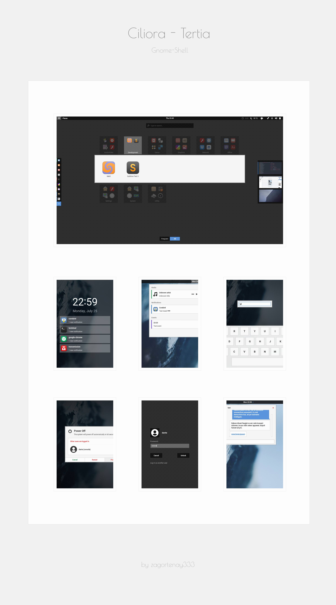

### Ciliora-Tertia for gnome-shell 

---

* [Compatibility](#compatibility)
* [Installation](#installation)
* [Login Screen](#login-screen)
* [Tips](#tips)
* [Contributing](CONTRIBUTING.md)
* [Development](#development)
* [Preview](#preview)

---

### Compatibility

The latest version of this theme is on the master branch, and it supports gnome-shell `3.26`.

For older versions, check the available [releases](../../releases).

---

### Installation

* Move the `Ciliora-Tertia` directory into `~/.themes`.

* Install the user-themes extension, and apply the theme in gnome-tweak-tool.

---

### Login Screen

In order to apply this theme to your login screen, move the `gnome-shell-theme.gresource` file into the `usr/share/gnome-shell` dir and restart gnome-shell.

* **Make sure that you backup the previous file before doing this!**

* **Be very careful when doing this! You could potentially break GDM and have a hard time logging back in if you screw up.**

* **Other themes won't look good until you restore the default root theme.**

* **Although rare, updates to the system could restore the old theme.**

---

### Tips

* To get rid of the overview background pattern, edit the `gnome-shell.css` file at selector `#overview`.

* To remove/change the activities icon, edit the `gnome-shell.css` file at selector `#panelActivities`. If you don't want to use an icon here, just get rid of that selector. The `menu-icons` folder contains a bunch of icons that you can try. :smile:

* To increase the max height of the calendar popup, edit the `gnome-shell.css` file at selector `#calendarArea`.

---

### Development

* **Watch and reload**

    The `watch` script will watch the chosen dirs for changes and
    recompile sass and reload the theme when a change occurs.

    > **Script dependencies:**
    >
    > * inotifywait
    > * sassc
    >
    > ---
    >
    > **NOTE:**
    > The script creates a link to the `Ciliora-Tertia` dir in `~/.themes`.

* **Generating the gresource file**

    Use the `gresource-gen` script to generate a gresource file (into the repo's root dir by default.) 

    > **Script dependencies:**
    >
    > * glib-compile-schemas

---

### Preview 

<b> [Wallpaper](https://imgur.com/raHVKVk), [Icons](https://github.com/moka-project/moka-icon-theme)</b>

