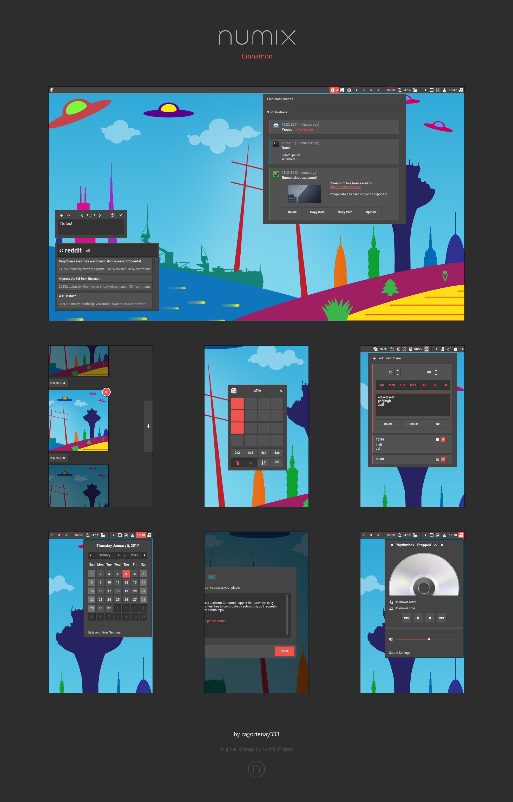

### Numix for cinnamon

---

### Installation

Move the `Numix-Cinnamon` folder into your `~/.themes` directory.

---

### Compatibility

The latest version of this theme is on the master branch, and it supports
cinnamon version `3.2`.

For older versions, check the available [releases](../../releases).

---

### Font

The default font is `Roboto` with `Noto Sans` and `Sans-Serif` fallbacks.

To change the font, edit the `cinnamon.css` file at selector `stage`
(beginning of file).

---

### Menu Icons

Check out the `menu-icons` dir which contains a lot of cool menu icons. :yum:

---

### Development

The `watch` script will watch the chosen dirs for changes and
recompile sass and reload the theme when a change occurs.

> **Script dependencies:**

> * inotifywait
> * sassc

> ---  

> **NOTE:**  

> The script creates a link to the `Numix-Cinnamon` dir in `~/.themes`.

---

<b> [Wallpaper](http://orig11.deviantart.net/8bdd/f/2017/063/4/8/numix_cinnamon_by_zagortenay333-d6dft70.png), [Icons](https://github.com/moka-project/moka-icon-theme)</b>

